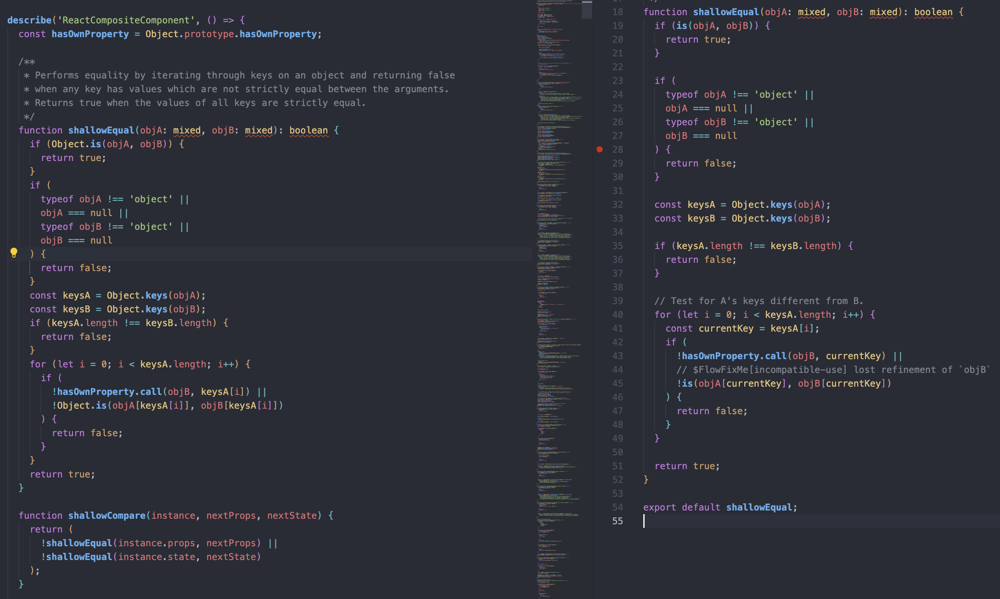

## 1장 : 리액트 개발을 위해 꼭 알아야 할 자바스크립트

### 1.1 자바스크립트의 동등 비교

`Object.is`는 메서드 명만 봤을 때 객체간의 동등 비교에 사용해야할 거 같은데 아니다.
`Object.is`는 +0,-0을 구분하고, NaN끼리 비교하면 같다고 처리를 해준다.
`===` 과 `Object.is`는 객체 비교에는 별 차이가 없다.

```javascript
-0 === +0; // true
Object.is(-0, +0); // false

NaN === 0 / 0; // false
Object.is(NaN, 0 / 0); // true

Object.is({}, {}); // false

const a = {
  hello: "hi",
};
const b = a;

Object.is(a, b); // true
a === b; // true
```

리액트가 얕은 비교로 컴포넌트를 리렌더링 하는건 알았지만, 내부적으로 `Object.is`를 사용하고 별도로 구현한 `shallowEqual`을 직접 보는건 처음이여서 흥미로웠다.

`shallowEqual`은 총 4단계의 분기 처리를 통해 동등 비교를 한다.

1. `Object.is`로 검사를 한다.
2. `Object.is`를 통과하지 못한 값이 null이나 객체가 아닌지 확인한다.
3. 3번 째의 분기문부터는 객체만 남았으므로 object key의 개수가 같은지 확인한다.
4. objA의 키를 순회하면서 objB에도 같은 키가 있는지, 또는 같은 값이 있는지 확인한다.

> 4단계를 모두 거쳤으면 객체간의 얕은 비교를 통해 1 depth에 존재하는 값이 같다는 의미이므로 true를 반환한다.

```javascript
const a = {
  hello: "hi",
};
const b = a;

shallowEqual(a, b); // 1. true
shallowEqual(NaN, NaN); // 1. true
shallowEqual(3, 4); // 2. false
shallowEqual({ a: "a", b: "b" }, { a: "a" }); // 3. false
shallowEqual({ a: "a", b: "b" }, { a: "a", c: "c" }); // 4. false
shallowEqual({ a: "a" }, { a: "a" }); // 5. true
shallowEqual({ b: "b", a: "a" }, { a: "a", b: "b" }); // 5. true
```

> 만약 배열의 경우 내부 값의 변경을 신경쓰지 않고 두 개의 배열이 동일한 주소를 가르키는지 판단한다.

### 개인적으로 궁금한점

react에서 `shallowEqual`를 구현한게 있는데 테스트 코드에서는 왜 동일한 기능을 다시 만들어서 사용을 했나?
차이점은 `Object.is` 폴리필 하지 않은것 밖에 모르겠다..


